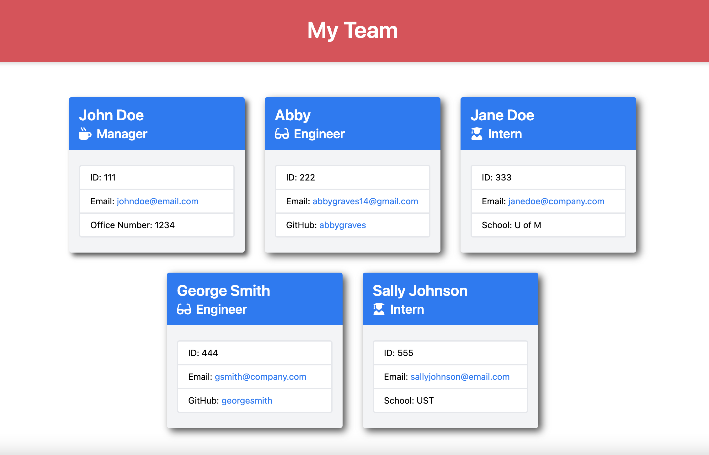

# Team Profile Generator


## **Description**
A command-line application that prompts the user to input information about a series of employees on a software engineering team. When the user is finished then an HTML webpage, displaying the summaries of each individual, will be dynamically generated.

### **Demo**
### [Click here to View Demo](https://youtu.be/jSBkE5Lrsf4)



<br/>

## **Build With:**
  + JavaScript
  + Node.js 
  + Inquirer package
  + Jest package
  + Tailwind
  + Font Awesome

<br/>

  ## **Installation** 
  ```md
  npm i jest
  ```
  
  ```md
  npm i inquirer@8.2.4
  ```

<br/>

## **Credit**
  + `inquirer.js` npm package: https://www.npmjs.com/package/inquirer
  + `Jest` npm package: https://www.npmjs.com/package/jest

<br/>

## **Got Questions?**
  Feel free to reach out with questions or comments regarding Team Profile Generator!
  
  [My GitHub Profile](https://github.com/abbygraves)&nbsp; :octocat: &nbsp;&nbsp;&nbsp; • &nbsp;&nbsp;&nbsp; abbygraves14@gmail.com&nbsp; :incoming_envelope:

<br/>

## **License**
```
MIT License


Copyright (c) 2022 Abigail J. Graves

Permission is hereby granted, free of charge, to any person obtaining a copy
of this software and associated documentation files (the "Software"), to deal
in the Software without restriction, including without limitation the rights
to use, copy, modify, merge, publish, distribute, sublicense, and/or sell
copies of the Software, and to permit persons to whom the Software is
furnished to do so, subject to the following conditions:

The above copyright notice and this permission notice shall be included in all
copies or substantial portions of the Software.

THE SOFTWARE IS PROVIDED "AS IS", WITHOUT WARRANTY OF ANY KIND, EXPRESS OR
IMPLIED, INCLUDING BUT NOT LIMITED TO THE WARRANTIES OF MERCHANTABILITY,
FITNESS FOR A PARTICULAR PURPOSE AND NONINFRINGEMENT. IN NO EVENT SHALL THE
AUTHORS OR COPYRIGHT HOLDERS BE LIABLE FOR ANY CLAIM, DAMAGES OR OTHER
LIABILITY, WHETHER IN AN ACTION OF CONTRACT, TORT OR OTHERWISE, ARISING FROM,
OUT OF OR IN CONNECTION WITH THE SOFTWARE OR THE USE OR OTHER DEALINGS IN THE
SOFTWARE.
```

&nbsp;&nbsp;&nbsp; [https://choosealicense.com/licenses/mit](https://choosealicense.com/licenses/mit)